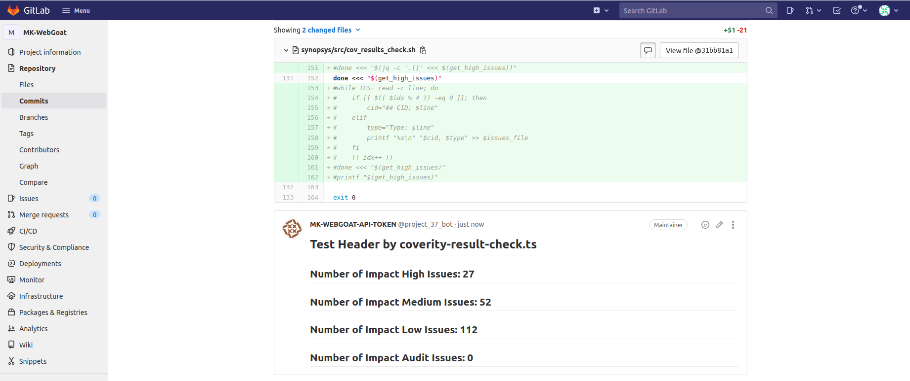

# gitlab-ci-node
GitLab CI integration with Synopsys Products using utility code in TypeScript

## Notable dependency
synopsys-sig-node (forked version) which is included as git submodule in this project.
https://github.com/sigjpengineers/synopsys-sig-node

## License
Distributed under the Apache Licnese, Version 2.0. See LICENSE.txt for more information.

## example

